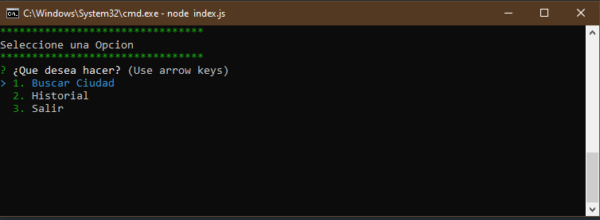

# Aplicacion Clima

Aplicacion en Node.js que consume las API de Geocoding y OpenWeatherMap

 

ver archivo package.json para instalar dependencias

ejemplo : ``npm init -y``

 

>Protip:
El archivo .env que contiene el token de acceso al servicio del API por seguridad no debe subirse a un repositorio como GITHUB

en su defecto se crea una copia del archivo y dentro de el se indica el espacio del token que deve colocarse

ejemplo:

MAPBOX_KEY = 